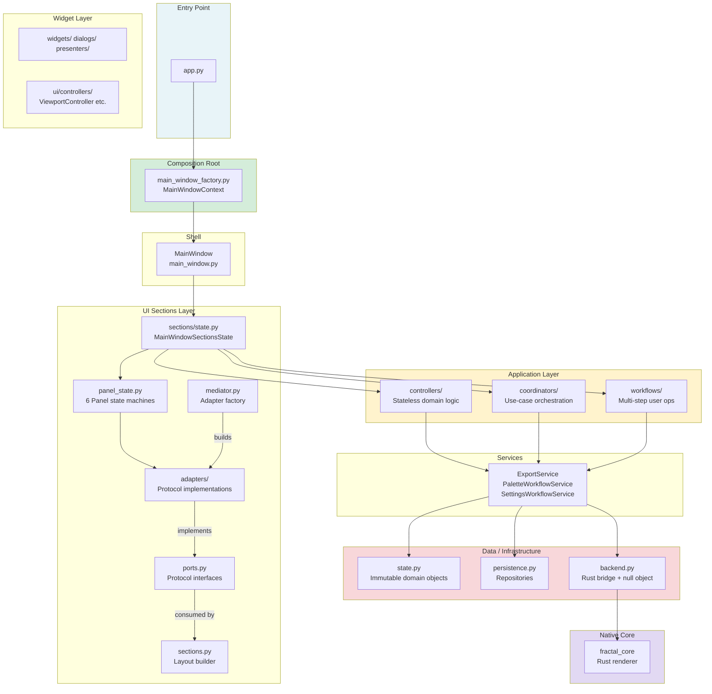
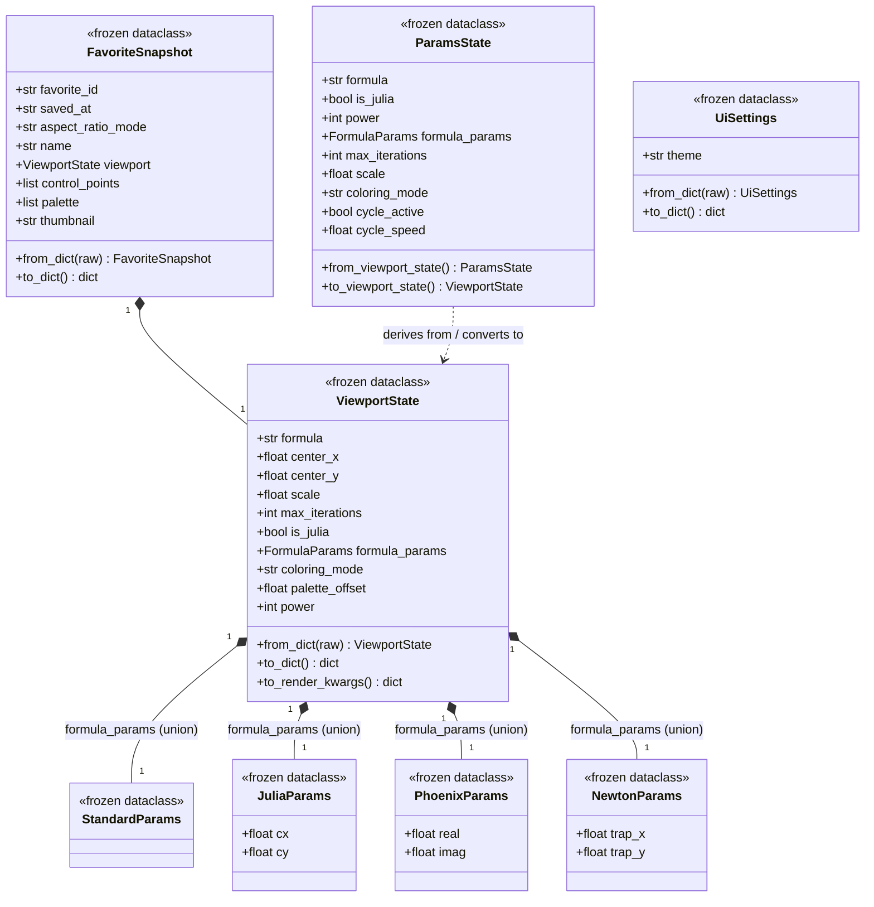
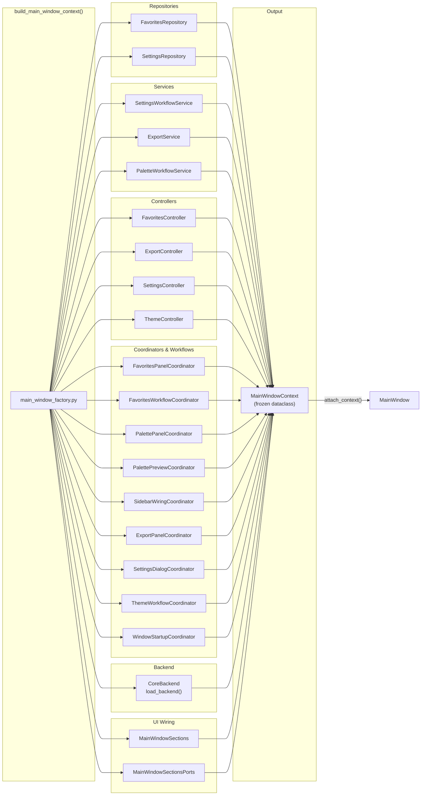
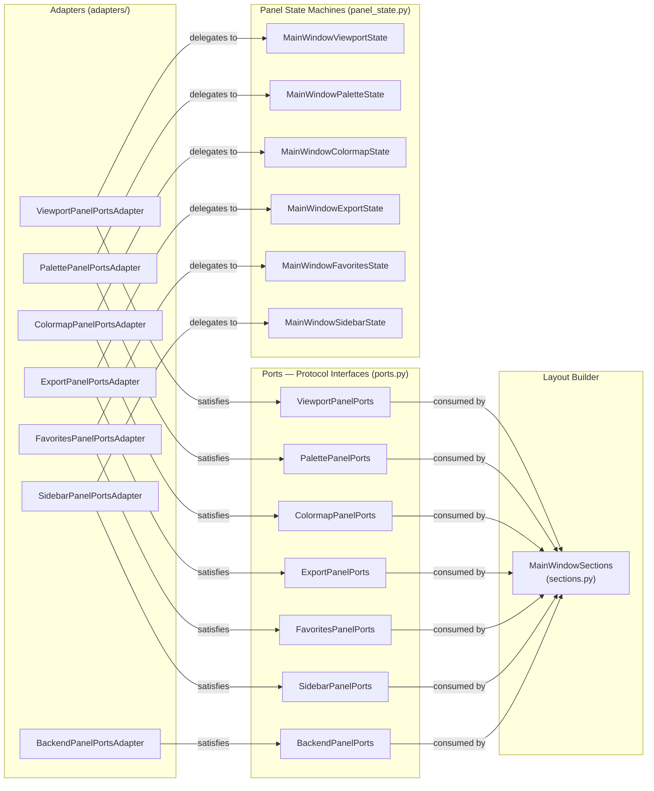
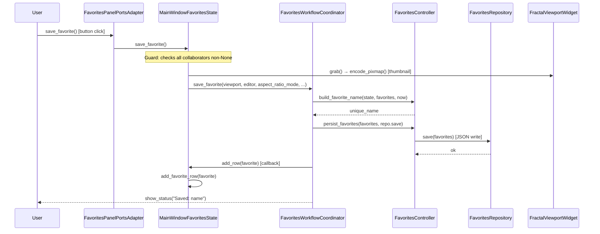

# Fractal Studio — Architectural Design

**Date:** 2026-05-28  
**Scope:** Python UI layer (`fractal-studio/ui/`) + Rust bridge interface  
**Version:** Current codebase (post-refactor)

---

## Table of Contents

1. [Executive Summary](#1-executive-summary)
2. [Technology Stack](#2-technology-stack)
3. [Package Structure](#3-package-structure)
4. [Layered Architecture](#4-layered-architecture)
5. [Data Model](#5-data-model)
6. [Dependency Injection & Factory](#6-dependency-injection--factory)
7. [Mediator / Ports Pattern](#7-mediator--ports-pattern)
8. [Data Flow: Save Favorite](#8-data-flow-save-favorite)
9. [SOLID Principles](#9-solid-principles)
10. [Design Patterns](#10-design-patterns)
11. [Deficiencies](#11-deficiencies)
12. [Future Direction](#12-future-direction)

---

## 1. Executive Summary

Fractal Studio is a layered PySide6 desktop app wrapped around a Rust renderer through a lazy-loading bridge. This page maps the structure, the design choices, and the debt that still deserves a raised eyebrow.

Fractal Studio is a **PySide6/Qt** desktop application for interactive fractal rendering and palette editing. It wraps a **Rust rendering engine** (`fractal_core`) with a lazy-loading Python bridge and presents a seven-panel workspace: fractal viewport, palette editor, colormap editor, parameter controls, export controls, favorites gallery, and sidebar.

The codebase has had a useful round of layering work. `MainWindowController` was split into `ExportController` and `SettingsController`; adapter files moved into a dedicated subdirectory; `ViewportState` now uses a discriminated union for formula-specific parameters; panel state machines receive collaborators through constructor injection; and `validate()` catches missing wiring at startup instead of waiting for runtime mischief.

**Overall grade:** B+ — structurally sound, with some complexity debt building up in the middle layers. The main risk is `MainWindowSectionsState`, which is drifting toward god-object territory.

---

## 2. Technology Stack

| Layer | Technology |
|-------|-----------|
| UI framework | PySide6 (Qt 6) |
| Language | Python 3.12+ |
| Rendering engine | Rust (via PyO3/maturin) |
| State model | Python frozen `dataclass` |
| Persistence | JSON, `~/.fractal_studio/` |
| Tests | pytest |
| Build (Rust) | cargo / maturin |

---

## 3. Package Structure

```
fractal_studio/
├── app.py                          Entry point (QApplication + factory)
├── main_window.py                  QMainWindow shell
├── main_window_factory.py          Dependency injection root
├── state.py                        Immutable domain objects
├── persistence.py                  JSON repositories
├── backend.py                      Rust bridge (lazy-load + null object)
├── theme.py                        Theme specs + QSS generation
├── editor.py                       ColorCubeEditor widget
├── viewport.py                     FractalViewportWidget + FractalParamsPanel
├── thumbnail_utils.py              Base64 image encode/decode
│
├── application/
│   ├── controllers/                Stateless domain logic atoms
│   │   ├── export_controller.py
│   │   ├── favorites_controller.py
│   │   ├── settings_controller.py
│   │   └── theme_controller.py
│   ├── coordinators/               Use-case orchestration per panel
│   │   ├── export_panel_coordinator.py
│   │   ├── favorites_panel_coordinator.py
│   │   ├── palette_panel_coordinator.py
│   │   ├── palette_preview_coordinator.py
│   │   ├── settings_dialog_coordinator.py
│   │   └── sidebar_wiring_coordinator.py
│   └── workflows/                  Multi-step user-visible operations
│       ├── favorites_workflow_coordinator.py
│       ├── startup_coordinator.py
│       └── theme_workflow_coordinator.py
│
├── services/
│   ├── export_service.py
│   ├── palette_service.py
│   └── settings_service.py
│
└── ui/
    ├── sections/                   Mediator/ports UI wiring layer
    │   ├── ports.py                7 Protocol interfaces
    │   ├── panel_state.py          6 Panel state machines
    │   ├── state.py                MainWindowSectionsState aggregate
    │   ├── mediator.py             Adapter factory
    │   ├── sections.py             Layout builder
    │   └── adapters/               Protocol implementations
    │       ├── __init__.py
    │       ├── base.py
    │       ├── viewport_adapter.py
    │       ├── palette_adapter.py
    │       ├── colormap_adapter.py
    │       ├── backend_adapter.py
    │       ├── export_adapter.py
    │       ├── favorites_adapter.py
    │       └── sidebar_adapter.py
    ├── controllers/                Widget-level event logic
    ├── dialogs/                    Modal dialogs
    ├── presenters/                 CSS/tooltip formatting
    └── widgets/                    Custom QWidget subclasses
```

---

## 4. Layered Architecture

The architecture follows a strict unidirectional dependency rule enforced by `test_import_policy.py`: lower layers do not know about higher layers.



**Dependency rules:**
- `state.py` imports nothing from the application or UI layers
- `persistence.py` imports only `state.py`
- `backend.py` is a pure bridge with no application layer imports
- Controllers import services and state, not widget classes
- `sections.py` knows only port Protocol interfaces

---

## 5. Data Model

All domain objects in `state.py` are **frozen dataclasses**: immutable, hashable, and serializable. The important structural choice is the **discriminated union** for formula-specific parameters, which makes invalid combinations unrepresentable at the type level.



**Serialization:** `from_dict()` handles both the current structured format, with a `formula_params.type` discriminator key, and the legacy flat format. Callers do not have to know migration happened, which is exactly how migration code should behave when it is behaving itself.

---

## 6. Dependency Injection & Factory

`main_window_factory.py` is the **composition root**. It builds the collaborators and assembles them into an immutable `MainWindowContext` before the UI event loop starts.



Once built, the wiring is fixed and inspectable.

---

## 7. Mediator / Ports Pattern

The `ui/sections/` layer uses a **Ports & Adapters** pattern. `sections.py` builds the Qt layout by calling Protocol methods, without knowing the business logic, widgets, or adapter implementations.



Each panel state machine receives its application-layer collaborators via constructor injection. This makes dependencies explicit and eliminates the silent-`None` failure mode.

---

## 8. Data Flow: Save Favorite

Tracing one user action through the layers shows how the pieces fit together:



**Observation:** Each layer touches only its own collaborators. `sections.py` never appears; it wired the button callback at startup and then got out of the way.

---

## 9. SOLID Principles

### S — Single Responsibility

**Applied well:**
- `ExportController`, `FavoritesController`, `ThemeController`, `SettingsController` each own exactly one domain. The recent split of `MainWindowController` removed a known SRP violation.
- `state.py` is pure data — its only responsibility is representing and serializing domain objects.
- `persistence.py` contains only file I/O logic; no business rules.
- `sections.py` has one job: build a Qt layout from port objects.

**Still imperfect:**
- `MainWindowSectionsState` (`sections/state.py`) is both a dependency bag and a lifecycle coordinator. It holds 20+ collaborator references as fields while also delegating to panel state machines via properties. Two responsibilities are present: "store all collaborators" and "orchestrate panel state construction."
- `MainWindowFavoritesState` (`panel_state.py`) has 13 constructor parameters. While each parameter has a clear role, the aggregate suggests this class does more than one thing (row management, selection, restoration, persistence delegation).

---

### O — Open/Closed

**Applied well:**
- `ports.py` Protocol interfaces allow new adapter implementations without modifying the protocol definitions or `sections.py`. A mock adapter for testing requires zero changes to existing code.
- `FormulaParams` discriminated union (`StandardParams | JuliaParams | PhoenixParams | NewtonParams`) is extensible: adding a new formula type requires a new frozen dataclass and an update to `from_dict()` only. Existing formula logic is untouched.
- `CoreBackend.profile()` returns a `BackendProfile` dataclass; callers don't pattern-match on backend internals.

**Still imperfect:**
- Adding a new UI panel still requires changes in 5 places: new Protocol in `ports.py`, new adapter file, new panel state class, registration in `mediator.py`, and a layout addition in `sections.py`. The Protocol layer is open for extension, but the wiring infrastructure is not.
- `backend.py`'s render methods (`render_mandelbrot`, `render_julia`, `render_fractal`) are formula-specific function calls; adding a new formula requires extending the backend interface.

---

### L — Liskov Substitution

**Applied well:**
- Any class that satisfies a port Protocol can substitute for any other implementation without behavioral changes in `sections.py`. This is structural subtyping — the layout builder cannot tell (and doesn't care) whether it holds a real adapter or a test double.
- `CoreBackend` wraps `None` with a null-object facade; any code that calls backend methods without checking `available` still gets safe return values.

**Still imperfect:**
- The null-object pattern is inconsistently applied: some coordinators and services guard with `if not self._backend.available` rather than relying on the null object to return safe defaults silently. This inconsistency means callers cannot uniformly trust LSP substitutability.

---

### I — Interface Segregation

**Applied well:**
- Seven distinct port interfaces instead of one monolithic `MainWindowPorts`. Each panel receives exactly the interface it needs — `BackendPanelPorts` has a single method; `FavoritesPanelPorts` has five.
- `ports.py` does not leak Qt internals to callers — return types are typed, not raw `QVariant`.

**Mildly imperfect:**
- `ColormapPanelPorts` has 9 methods including a `backend` property, `backend_profile` property, and `viewport` property. These are likely needed, but the interface is wider than the others and worth reviewing if it grows.

---

### D — Dependency Inversion

**Applied well:**
- The application layer (`controllers/`, `coordinators/`, `workflows/`) depends on injected abstractions. Controllers receive repositories and services, not concrete file handles.
- `main_window_factory.py` is the explicit composition root — it is the only place that constructs concrete implementations and wires them together.
- Panel state machines depend on collaborator protocols/callables, not on concrete Qt widgets or business-logic classes directly.

**Still imperfect:**
- Several panel state machines accept `MainWindow` directly (for `statusBar().showMessage`). This couples them to a concrete Qt class rather than a narrow `show_status: Callable[[str], None]` abstraction. The fix is to inject the callable instead of the window.
- `MainWindowSectionsState` creates lambda closures over `self` inside `bind()`. These closures capture the mutable state object by reference — not a DI violation, but a lifecycle dependency that is implicit.

---

## 10. Design Patterns

### Repository Pattern
**Where:** `persistence.py` — `FavoritesRepository`, `SettingsRepository`  
**Purpose:** Encapsulate all JSON file I/O behind a clean load/save interface. Callers never see file paths, error handling, or schema migration logic.  
**SOLID link:** SRP (persistence separated from domain logic), DIP (controllers accept a `save` callable, not a repository).

---

### Mediator Pattern
**Where:** `ui/sections/mediator.py` — `build_sections_ports()`  
**Purpose:** Coordinate communication between panel sections without direct coupling. The mediator builds the `MainWindowSectionsPorts` aggregate from individual adapters; the layout builder `sections.py` interacts with the mediator's output rather than with panel state machines directly.  
**SOLID link:** OCP (new panels can be added by registering a new adapter; existing code is unchanged).

---

### Ports & Adapters (Hexagonal Architecture)
**Where:** `ui/sections/ports.py`, `ui/sections/adapters/`  
**Purpose:** Isolate the layout-building code (`sections.py`) from business logic. Protocols define the hexagon boundary; adapters bridge the inside (panel state machines) to the outside (layout builder).  
**SOLID link:** ISP (one small Protocol per panel), DIP (layout builder depends on Protocol, not implementation), LSP (any adapter that satisfies the Protocol is substitutable).

---

### Factory / Composition Root
**Where:** `main_window_factory.py` — `build_main_window_context()`  
**Purpose:** Centralize all construction and wiring. This is the only location that holds knowledge of which concrete class implements which interface.  
**SOLID link:** DIP (the rest of the codebase never constructs its own dependencies).

---

### Null Object Pattern
**Where:** `backend.py` — `CoreBackend`  
**Purpose:** Allow the full UI to launch and operate without a compiled Rust module. When `fractal_core` is absent, `CoreBackend` wraps `None` and all methods return safe defaults.  
**SOLID link:** LSP (backend callers can treat `CoreBackend` uniformly whether or not Rust is loaded, as long as the null-object contract is consistently applied).

---

### Immutable Value Object
**Where:** `state.py` — all `@dataclass(frozen=True)` types  
**Purpose:** Prevent accidental mutation of domain state as objects flow through layers. Snapshots, serialization, and equality comparisons are all trivially correct.  
**SOLID link:** SRP (no behavior beyond representation and serialization).

---

### Observer / Signal-Slot
**Where:** PySide6 signals throughout `viewport.py`, `editor.py`, `ui/controllers/`  
**Purpose:** Decouple widget event producers from consumers. `SidebarWiringCoordinator` connects param-panel signals to viewport slots without either widget knowing about the other.  
**SOLID link:** OCP (new signal connections can be added without modifying widget classes).

---

### State Machine
**Where:** `ui/sections/panel_state.py` — `MainWindowViewportState`, `MainWindowFavoritesState`, etc.  
**Purpose:** Each panel state machine encapsulates the widget references and collaborator methods for one panel's lifecycle. State is managed by the state machine; the adapter is a thin forwarding shell.  
**SOLID link:** SRP (each panel's state is managed in exactly one class).

---

### Discriminated Union (Sum Type)
**Where:** `state.py` — `FormulaParams = StandardParams | JuliaParams | PhoenixParams | NewtonParams`  
**Purpose:** Make invalid formula parameter combinations unrepresentable at the type level. Before this pattern was introduced, all formula params coexisted as flat fields regardless of which formula was active.  
**SOLID link:** OCP (new formulas extend the union; existing formula code is untouched).

---

## 11. Deficiencies

### D1 — `MainWindowSectionsState` Is a Partial God Object

`sections/state.py`'s `MainWindowSectionsState` holds 20+ named collaborators as dataclass fields, then constructs 6 panel state machines inside `bind()`. Its `bind()` method is ~60 lines of wiring code. That makes it both dependency container and panel-state factory, which is a lot of hats for one class.

**Impact:** Any change to the panel wiring requires modifying this single class. It is the integration point for the entire application and therefore accretes complexity with every new feature.

**Recommendation:** Promote `main_window_factory.py` to construct panel state machines directly. `MainWindowSectionsState` should hold only panel state machine references, not all upstream collaborators. The factory already constructs all collaborators — it should also construct the panel states that need them.

---

### D2 — `validate()` Checks Field Names as Strings

`MainWindowSectionsState.validate()` iterates a hardcoded list of string attribute names and calls `getattr`, which means it can silently miss any collaborator not in the list.

**Recommendation:** Replace the string-list approach with a dataclass `__post_init__` or a Pydantic model that enforces non-None at construction time. Alternatively, generate the list from `dataclasses.fields()` filtered by type annotation (excluding `Optional` fields).

---

### D3 — No Test Markers (pytest.ini)

Six tests fail without PySide6. There is no marker config, so `pytest` is not green in headless CI.

**Impact:** Contributors cannot verify that pure-Python changes are correct without either installing PySide6 or knowing which tests to skip manually.

**Recommendation:** Add `pytest.ini` with markers `unit` and `integration`. Default run executes `unit` only. All tests importing PySide6 receive `@pytest.mark.integration`.

---

### D4 — Some Panel States Accept `MainWindow` Directly

`MainWindowColormapState`, `MainWindowFavoritesState`, and `MainWindowExportState` accept `owner: MainWindow` in their constructors only so they can call `statusBar().showMessage`.

**Impact:** These state machines are coupled to a concrete Qt class, making them untestable without a real `QMainWindow`. A narrow `show_status: Callable[[str], None]` injection would decouple them.

**Recommendation:** Replace `owner: MainWindow` with `show_status: Callable[[str], None]` where the only usage is `statusBar().showMessage`. Reserve `owner` for cases that genuinely require a parent widget reference (e.g., file dialogs).

---

### D5 — Backend Null-Object Inconsistently Applied

Some coordinators guard with `if not self._backend.available`; others rely on the null object. Both can work, but mixing them makes the contract fuzzier than it needs to be.

**Impact:** When adding new backend calls, developers must determine which pattern to follow by convention rather than by the null-object contract.

**Recommendation:** Audit all callers and commit to one approach: either the null object always returns safe defaults (and guards are removed), or the null object raises so callers must guard. The null-object-returns-defaults approach is simpler.

---

### D6 — Render Scheduling Has No Teardown Guard

`FractalViewportWidget` uses a `QTimer` to coalesce render calls. The timer is created once and reused. The viewport's `QTimer` can fire after the widget is destroyed during teardown or a fast close.

**Impact:** During test teardown or rapid window close, the timer can fire after the widget and its Rust backend reference are gone, potentially causing a crash or a no-op that logs confusing output.

**Recommendation:** Connect `timer.stop()` to the widget's `destroyed` signal, or check `self.isVisible()` and `self.isEnabled()` before scheduling.

---

### D7 — `ThemeWorkflowCoordinator` Has Hidden Side Effect

`ThemeWorkflowCoordinator.apply_theme_name()` may persist settings without saying so in its signature. Sneaky side effects are rarely as charming as they think they are.

**Impact:** The method name gives no indication that it may persist settings as a side effect. Callers cannot call it for preview-only purposes without auditing the implementation.

**Recommendation:** Add a `persist: bool = False` parameter with an explicit conditional. The method name can then remain unchanged with no ambiguity.

---

## 12. Future Direction

### F1 — Async Rendering (High Priority)

Currently, `CoreBackend.render_fractal()` is a synchronous call on the Qt main thread. For high-iteration-count renders or large exports, this will freeze the UI noticeably.

**Recommended approach:** Move render calls to a `QThread` subclass or `QRunnable`. Emit a Qt signal carrying the rendered result back to the main thread. The `ViewportController`'s existing `QTimer` debouncing already provides the right abstraction boundary — the timer callback becomes a thread dispatch instead of a direct render call.

---

### F2 — Command / Event Bus for Cross-Panel Communication

Currently, cross-panel actions flow through chains of coordinators and lambda callbacks. As the application grows, these chains become harder to trace and test.

**Recommended approach:** A lightweight in-process event bus (not a full pub/sub framework) where each panel emits typed events and subscribes to events from other panels. This would replace many of the lambda chains in `bind()` with explicit, testable event subscriptions.

---

### F3 — `fractal_core.pyi` Type Stub

The expected Rust module interface (20+ functions) is inferred entirely from `backend.py`. There is no type stub that lets mypy or pyright verify that Python calls match Rust exports.

**Recommended approach:** Generate a `fractal_core.pyi` file using `pyo3-stub-gen` or hand-write one alongside the Rust source. Commit it to `core/src/`. This gives the Python side static type checking against Rust exports and documents the API contract explicitly.

---

### F4 — Undo/Redo System

Users cannot step back through viewport changes. Every pan, zoom, or formula change is irreversible without loading a saved favorite.

**Recommended approach:** Maintain a bounded deque of `ViewportState` snapshots in `ViewportController`. Expose undo/redo as keybindings that pop from the deque and re-render. Because `ViewportState` is immutable, the deque holds references cheaply.

---

### F5 — Settings Schema Migration

`state.py` defines `SETTINGS_SCHEMA_VERSION = 1` and `FAVORITES_SCHEMA_VERSION = 1`, but no migration logic exists. When schema version 2 is needed, there is no infrastructure to upgrade existing user data.

**Recommended approach:** Add a `migrate(raw: dict, from_version: int, to_version: int) -> dict` function in `persistence.py`. `from_dict()` calls it whenever the loaded version is older than the current constant. This keeps migration logic out of the main deserialization path.

---

### F6 — Property-Based Tests for State Serialization

State serialization (`to_dict` / `from_dict` round-trips) is currently tested only with fixed fixtures. Property-based tests would catch edge cases (extreme floats, empty lists, unknown keys) automatically.

**Recommended approach:** Add Hypothesis tests for `ViewportState`, `FavoriteSnapshot`, and `UiSettings` round-trips. These are pure-Python tests with no Qt dependency — they belong in the `unit` marker group and run in CI without PySide6.

---

### F7 — Reduce `MainWindowSectionsState` to a Panel-State-Only Container

As a structural follow-through to [D1](#d1--mainwindowsectionsstate-is-a-partial-god-object), the factory should construct panel state machines directly and inject only panel states into `MainWindowSectionsState`. The 20+ collaborator fields on `MainWindowSectionsState` should live only in the factory's scope — not as persistent attributes on a runtime object.

```python
# Target state (illustrative)
@dataclass
class MainWindowSectionsState:
    viewport: MainWindowViewportState
    sidebar: MainWindowSidebarState
    palette: MainWindowPaletteState
    colormap: MainWindowColormapState
    favorites: MainWindowFavoritesState
    export: MainWindowExportState
```

This aligns the class name with its actual responsibility: holding panel states.

---

*Document generated 2026-05-28. Reflects the current post-refactor codebase.*
